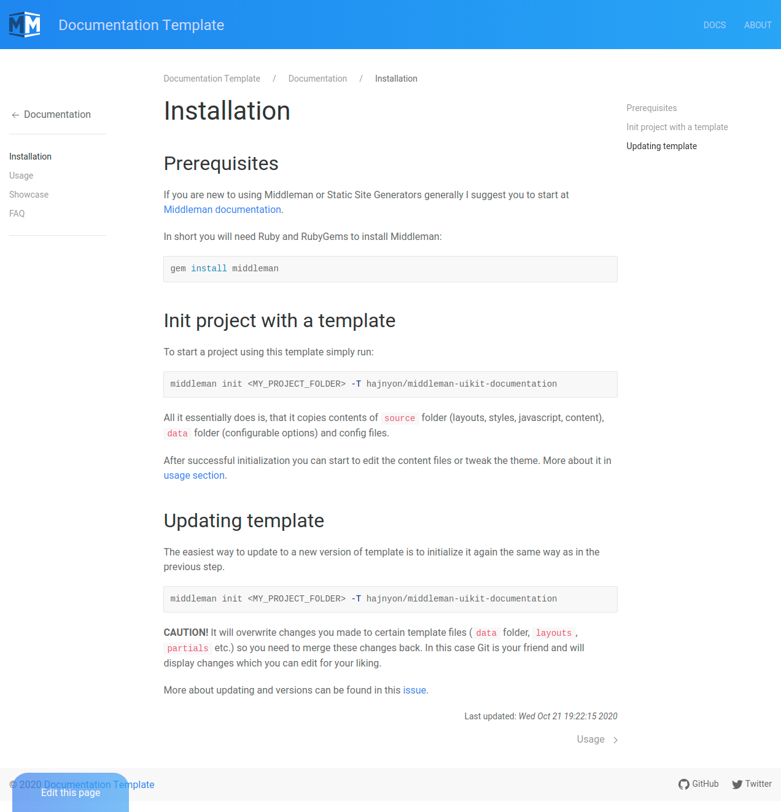

# Middleman UIkit documentation template

Template for documentation pages styled with UIkit for Middleman.

Check [demo](https://hajnyon.gitlab.io/middleman-uikit-documentation-demo/) or learn about customization and usage in [documentation](https://hajnyon.gitlab.io/middleman-uikit-documentation-demo/docs/usage/).



## Features

### Implemented

-   layouts - landing, contents list and documentation
-   breadcrumbs
-   sidebar nav
-   code snippets highlights
-   two level navbar
-   [GitLab SSE](https://docs.gitlab.com/ee/user/project/static_site_editor/) ready

### [Planned](https://github.com/hajnyon/middleman-uikit-documentation-template/issues?q=is%3Aissue+is%3Aopen+label%3Aenhancement)

-   next and previous links
-   optional right sidebar with links to second level heading
-   heading anchors
-   search

## Instalation

```bash
middleman init MY_PROJECT_FOLDER -T hajnyon/middleman-uikit-documentation-template
```

## Configuration

**data/config.yml** - basic site configuration

```yml
repository: https://gitlab.com/hajnyon/middleman-uikit-documentation-demo # repository for gitlab static site editor
site_name: 'Documentation Template' # site name displayed in logo, titles and links
```

**data/footer_links.json** - social links in footer

```json
[
    {
        "url": "//github.com",
        "label": "GitHub",
        "icon": "github"
    },
    {
        "url": "//twitter.com",
        "label": "Twitter",
        "icon": "twitter"
    }
]
```

**data/navigation_links.json** - links displayed in top navigation (2 levels supported)

```json
[
    {
        "url": "/docs/index.html",
        "label": "Docs",
        "sub": [
            { "url": "docs/install", "label": "Installation" },
            { "url": "docs/usage", "label": "Usage" },
            { "url": "docs/showcase", "label": "Showcase" }
        ]
    },
    {
        "url": "about",
        "label": "About"
    }
]
```

## Content

-   **source/index.html.md** - landing page content
-   **source/about.html.md** - about page content
-   **source/docs** - content of documentation itself
-   **source/partials/\_hero.erb** - edit to customize landing page hero

## Layouts

-   **home** - landing page
-   **contents** - documentation contents list
-   **documentation** - default documentation layout (sidebar and breadcrumbs, default for `docs/*`)

## Frontmatter

You can specify order attribute to sort links in sidebar navigation.

```md
---
title: Showcase
order: 3
---
```

For more visit [documentation](https://hajnyon.gitlab.io/middleman-uikit-documentation-demo/docs/usage/).

## Credits

-   [middleman](//middlemanapp.com)
-   [middleman.com](https://github.com/middleman/middlemanapp.com)
-   [middleman-templates-blog](https://github.com/middleman/middleman-templates-blog)
-   [middleman-syntax](https://github.com/middleman/middleman-syntax)
